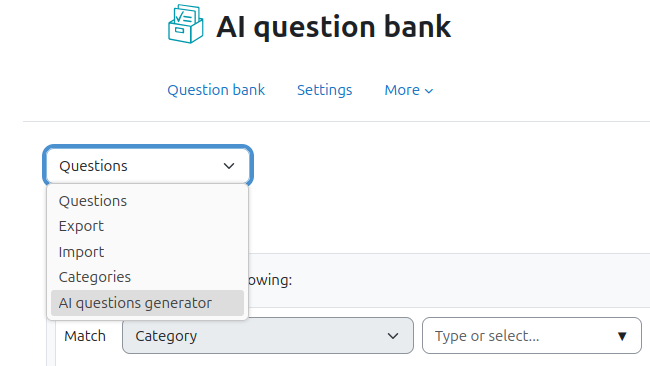
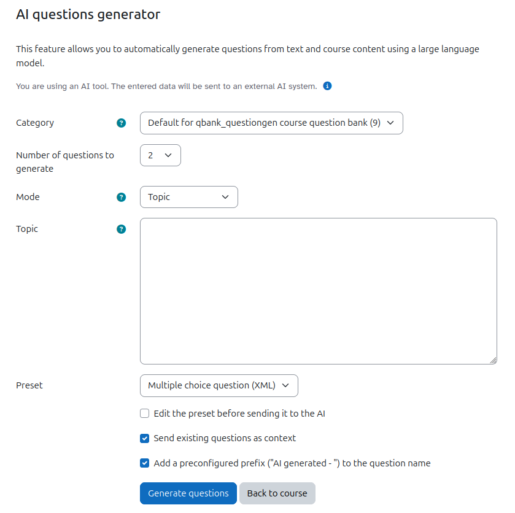

# AI question generator #

This plugin allows you to automatically create questions using a large language model. It requires the local_ai_manager plugin (https://github.com/bycs-lp/moodle-local_ai_manager) that manages the connection to the external AI system and the local_ai_content plugin (https://github.com/bycs-lp/moodle-local_ai_content) for document conversion and text extraction from files. It's a fork of the "AI Text to questions generator" created by Yedidia Klein and Ruthy Salomon.

The plugin is in an alpha to beta stadium right now.

# Features
* The plugin basically does a lot of preprompting for the user to generate a Moodle XML question that instantly is being imported into the question bank.
* How this XML is being generated can be customized by the admin as well as the user. The admin will be able to configure presets that the user can "just use". A set of presets is being shipped with the plugin.
* The user can select between three modes
  * *Topic:* Specify a short topic that the questions should be about. The external AI system will generate questions related to this topic by using its owning training data.
  * *Story:* Specify the data from which the external AI system should generate questions from. This can be whole wikipedia articles. The user can paste in whatever content he/she wants the AI system to use. The AI system is being advised not to use any information besides the one provided by the user in this mode.
  * *Course contents:* Select activities from your course the plugin should extract the content from. Currently supported are:
    * Text and media area
    * Page
    * File
    * Folder
    * Lesson
    * Book
    * maybe more to come...

    The plugin will extract the text from these activities and send them to the AI system as context to generate questions from. This will typically not respect embedded images or PDF files.

    **File and folder activities are currently supported for files with image file type and PDF (and plain text files obviously). For being able to use "File" or "Folder" activities you will have to configure an AI tool in the local_ai_manager for "image to text" purpose.** The files will be sent to the external AI system that will extract the text. PDF conversion and extraction are handled by the local_ai_content plugin. As the extraction of information from PDF (especially multipage PDFs) can be expensive regarding token usage, extracted text is cached by local_ai_content.
* In the question generation form the user can choose if he/she wants to send existing questions from the question bank as context to the external AI system. In this case the AI system is being advised to generate **different** questions from the ones being provided. Only the question title and question text are being passed to the AI system in this case.
* The admin can define a prefix that should be added to the title of the questions. The user will be able to enable/disable this feature.
* If the admin defines a tag, the generated questions will also be tagged with this tag. The user cannot overwrite this setting.
* Question generation with AI can be tricky and can take some time. Therefore, all generation actions are being done by adhoc tasks in the background. However, the user will see a status bar and receive feedback what's going on.
* As LLM do not really "understand" Moodle XML and just work with examples and "generate something similiar" the background processes will try to parse the generated XML up to a configurable number of times. If no parseable question is being generated, this will be feedbacked to the user. Adhoc tasks are never being retried, also not on failure. The user will have to start a new question generation.
* The table `qbank_questiongen` contains all the question generation processes (one question each line). Admins with access to the database can use this to debug problems. A cleanup job will clean up the entries after a configurable delay.

## Automatic Preset Selection

The **Preset selection** field defaults to **Fixed preset**. Choose **AI selection** to let the AI select a suitable preset for each question based on the supplied content and pedagogical criteria.

- **Restrict question types (optional)** is a searchable multi-select. Leave it empty to allow all currently valid presets. Multiple presets of the same type remain separate candidates.
- **Pedagogical requirements (optional)** accepts learning objectives, target age, cognitive demand and teaching scenarios, up to 4000 characters. The requirements guide both selection and generation. They do not override the type restriction or the source-only rule in content modes.
- Selection prioritises suitability, not a guaranteed distribution of question types. Direct prompt/template editing remains available only for fixed presets.
- New valid administrative presets are immediately available to new requests. The XML example determines the internal Moodle question type; there is no hard-coded list of five types or separate AI approval step. Optional suitability descriptions can be entered in preset administration, up to 2000 characters; otherwise existing instructions provide the selection context.
- Examples must contain exactly one supported question, no DTD, category instructions, description question or legacy `image_base64` fields, and be at most 256 KiB. New or edited examples are validated once before saving; the catalogue uses stored question types and checks that their plugins are installed. Shipped defaults already contain tested type metadata. New AI responses are still validated before import, accepting Moodle's aliases for the same internal question type.
- Each automatic batch stores its immutable catalogue, type filter and pedagogical requirements once in the first `qbank_questiongen.selectiondata` record (maximum 1 MiB). Editing or deleting a preset later does not change an existing batch. Task customdata contains IDs and processing options, not the catalogue or pedagogical prompt.
- The selected preset ID is stored before generation. Invalid selection responses get at most one retry. Invalid XML uses the configured attempt budget without repeating preset selection. Provider failures stop the batch; successful questions are retained. Every imported response must contain exactly one question, and automatic responses must match the selected type.
- User-linked processing records are exported and deleted through the Privacy API in the system context and removed by scheduled cleanup. Queued generation tasks are included in user deletion. AI-manager logs and generated question-bank entries have their own privacy providers and retention rules.

No additional AI purpose or frontend JavaScript build is required. Before deploying version `2026091800`, stop new generation requests and finish or cancel pending questiongen tasks from older versions; old task formats are not supported. Run the standard Moodle upgrade. **Existing presets are not replaced or parsed automatically.** Site administrators receive a forced popup/email notification linking to preset management: open and save presets without type metadata, or export a backup and manually replace obsolete entries with a tested bundle. Normal JSON import remains non-overwriting, including for identical entries without metadata: use the edit-and-save workflow or explicitly delete entries before replacing them. Already generated Moodle questions are unaffected.

Implementation plan and local verification results: [docs/ki-vorlagenauswahl-plan.md](docs/ki-vorlagenauswahl-plan.md).

## Import and Export Presets

Preset administrators can upload a JSON bundle on the global preset management page, export the entire catalogue, or download an individual preset using its export icon. All operations require `qbank/questiongen:manage`; imports and downloads also require a valid session key.

The portable format is `qbank_questiongen_presets`, version `1`, with a `presets` array containing `name`, `primer`, `instructions`, `example` and optional `selectiondescription`. Database IDs, timestamps and AI provider configuration are not exported. Question type metadata is derived from each XML example on the receiving site.

Imports accept up to 100 presets and 8 MiB per JSON file; exports exceeding these limits are rejected with a notice to export individual presets. Manual editing and import share the same field validation: XML, primer and instructions at most 256 KiB each, names 255 characters and suitability descriptions 2000 characters. Every entry is validated before any database write. Unsupported types or invalid entries reject the entire bundle. Exact duplicates are skipped, including duplicates within the same file; different content with the same name creates a new preset and never overwrites an existing one. Existing invalid presets can still be exported for offline correction within the file limits, but must be corrected before reimporting.

An optional [21-type preset library](docs/presets-library.json) is included, with [coverage, prerequisites and provenance](docs/presets-library.md). It is not installed automatically on other sites: importing the complete library requires its additional question type plugins. Export individual compatible presets when moving to a site with fewer plugins.

## Security

- Preset administration requires the system-level `qbank/questiongen:manage` capability. Generation requires `moodle/question:add` in the target category, checked again before background processing and at import. Form submissions and administrative actions retain session-key validation.
- Existing-question context includes only questions the requesting user can view (`viewall`, or `viewmine` for their own questions).
- Source activities must remain accessible in the request's course. Module read capabilities are enforced and hidden book chapters require `mod/book:viewhiddenchapters`. Full lesson extraction requires `mod/lesson:manage`, because reading every page is not equivalent to following a learner's restricted lesson path.
- Source files are read through the File API in their source module context. AI extraction uses the requesting user's identity, not the file owner's quota or permissions. Generated question files are imported by Moodle into the authorised target category context.
- Generated XML text fields are cleaned with Moodle's HTML APIs before import. Markdown fields are converted to cleaned HTML; plain-text fields keep their format. XML structure/type validation is not treated as HTML sanitisation. These controls apply to new imports, not previously generated questions.
- Progress messages contain fixed localised status/error text, not raw provider errors or source content.

## Care ##
Question generation, especially with substantial content, can use many tokens. Selection and generation share the AI manager's `questiongeneration` quota: normally two requests per question, or one when only one preset is allowed, plus any retries. The quota is not reserved for the whole batch; it may be exhausted after selection and before generation. Monitor token costs separately from request counts.

Also, this feature should be used responsibly in terms of resource consumption.

## Fork ##

This plugin is a (renamed) fork of https://github.com/yedidiaklein/moodle-local_aiquestions.

Thank you very much for providing the initial idea and code base.

## License ##

2025, ISB Bayern
Lead developer: Philipp Memmel <philipp.memmel@isb.bayern.de>

This program is free software: you can redistribute it and/or modify it under
the terms of the GNU General Public License as published by the Free Software
Foundation, either version 3 of the License, or (at your option) any later
version.

This program is distributed in the hope that it will be useful, but WITHOUT ANY
WARRANTY; without even the implied warranty of MERCHANTABILITY or FITNESS FOR A
PARTICULAR PURPOSE.  See the GNU General Public License for more details.

You should have received a copy of the GNU General Public License along with
this program.  If not, see <https://www.gnu.org/licenses/>.
